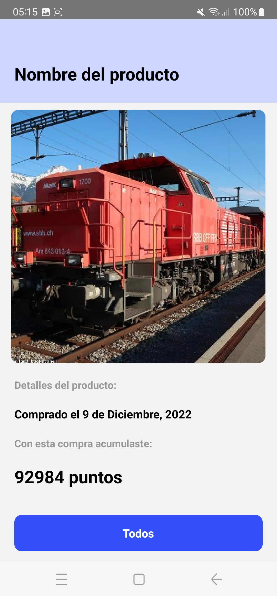

# FEMSA Digital House Challenge


<div>
<p style = 'text-align:center;'>



</p>
</div>

===>  Ver [Video](https://www.youtube.com/shorts/kXCCCk8kwEE)  ᕙ(`▿´)ᕗ

Esta es una aplicación para canjear puntos hecha en React Native y Typescript con  React-native CLI 

### How to run

```
1. git clone 
2. cd f3_camada_8
3. yarn install
4. yarn android
```

### Criterios de aceptación

Los siguientes elementos son mandatorios para el code challenge:

- Conexión al endpoint
- Navegación entre pantallas
- Pruebas unitarias

Los siguientes elementos son deseables:

- Filtro
- Mantener todos los elementos “pixel perfect”
- Pruebas unitarias de componente o de integración

### Formato de Entrega

- Se deberá de entregar el proyecto en un .zip o en algún repositorio remoto (GitHub,
  gitlab, bitbucket). Deberá de contener un screenshot de cada una de las pantallas de la
  aplicación.

 Made by [Rafael Amaya](https://www.linkedin.com/in/rafael-amaya/)  ᕙ(`▿´)ᕗ